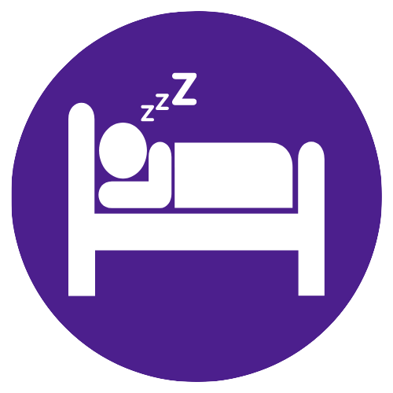

# Thank You! {.unnumbered}

Dear `r params$parent_name` and `r params$child_name`,

Thank you so much for taking part in our research study.
We truly appreciate the time and effort both of you have given to help us understand more about children's daily activities.
The data you provided by wearing the camera and accelerometer is incredibly valuable for our research, and it will help us gain new insights into children's physical activity, sleep, screen time, and overall well-being.

Your contribution is helping us create a better understanding of children's health, which could benefit not just your family, but also many other families in the future.

This report is meant to give you a glimpse into some of the data that we captured during the study, offering insights into your child's physical activity and sleep patterns.
None of this data is intended to be used for diagnostic purposes, but rather to provide you with a general overview of your child's daily activities.

Thank you again for being part of this important journey with us.

Warm regards,

<span style="font-size: 1.5em; color: #4C1F8D;">KidVision Team</span>

\newpage

```{r, echo=FALSE, message=FALSE}
library(ggplot2)
library(readr)
library(dplyr)
```

```{r fetch-data, echo=FALSE, message=FALSE}
files <- list.files(
  file.path(
    params$folder_path,
    glue::glue("output_{params$participant_id}"), "results"
  ),
  full.names = TRUE
)
p5_filepath <- files[grep("part5_daysummary_WW", files)]
p5_df <- readr::read_csv(p5_filepath) |>
  dplyr::filter(ID == params$participant_id) |>
  dplyr::mutate(weekday = factor(weekday,
    levels = c(
      "Monday", "Tuesday", "Wednesday", "Thursday", "Friday",
      "Saturday", "Sunday"
    )
  ))
```

# Particpant Report {.unnumbered}

##  Physical Activity {.unnumbered}


```{r, echo=FALSE, message=FALSE, fig.width=10, fig.height=6, out.width="100%", fig.align="center"}
pa_df <- p5_df |>
  dplyr::select(
    weekday, dur_day_total_LIG_min, dur_day_total_MOD_min, dur_day_total_VIG_min
  ) |>
  dplyr::rename(
    light_pa = dur_day_total_LIG_min,
    moderate_pa = dur_day_total_MOD_min,
    vigorous_pa = dur_day_total_VIG_min
  ) |>
  dplyr::mutate(mvpa = moderate_pa + vigorous_pa)

mean_mvpa <- round(mean(pa_df$mvpa, na.rm = TRUE), 1)

ggplot2::ggplot(
  data = pa_df,
  ggplot2::aes(x = weekday, y = mvpa, label = round(mvpa, 1))
) +
  ggplot2::geom_bar(
    stat = "identity", fill = "transparent", color = "#4C1F8D"
  ) +
  ggplot2::geom_text(vjust = -0.5, color = "#4C1F8D") +
  ggplot2::labs(x = "", y = "") +
  ggplot2::ggtitle(paste(
    "Time spent in moderate or vigorous activity (average is",
    mean_mvpa,
    "minutes per day)"
  )) +
  ggplot2::theme(
    panel.grid = ggplot2::element_blank(),
    panel.background = ggplot2::element_blank(),
    plot.title = ggplot2::element_text(face = "bold", color = "#4C1F8D"),
    axis.line.y = ggplot2::element_line(color = "#4C1F8D"),
    axis.text = ggplot2::element_text(color = "#4C1F8D"),
    axis.title = ggplot2::element_text(color = "#4C1F8D")
  ) +
  ggplot2::geom_hline(yintercept = 60, color = "red", linetype = "dashed") +
  ggplot2::geom_bar(
    data = subset(pa_df, weekday %in% c("Saturday", "Sunday")),
    stat = "identity", fill = "#D7C9F1", alpha = 0.5
  )
```

The graph shows an overview of `r params$child_name` physical activity.
According to the Australian Government and the Department of Health and Aged Care, children aged 5 to 17 should aim for at least **60 minutes** of moderate to vigorous activity each day.
This recommendation is designed to support healthy growth, development, and overall well-being.

Keep in mind that we measure physical activity from the wrist, so some activities like cycling or swimming may get missed.
If your child does a lot of these activities, their actual physical activity levels may be higher than what is shown here.

\newpage

##  Sleep {.unnumbered}

### Sleep Duration {.unnumbered}

```{r sleep-dur, echo=FALSE, message=FALSE}
sleep_df <- p5_df |>
  dplyr::filter(dur_spt_sleep_min < 800, dur_spt_sleep_min > 180) |>
  dplyr::transmute(
    sleep = dur_spt_sleep_min / 60,
    nocturnal_wake = (dur_spt_wake_IN_min + dur_spt_wake_LIG_min +
      dur_spt_wake_MOD_min + dur_spt_wake_VIG_min) / 60,
    total_sleep_time = sleep + nocturnal_wake,
    weekday = weekday
  )

mean_total_sleep <- round(mean(sleep_df$total_sleep_time, na.rm = TRUE), 1)
max_total_sleep <- max(sleep_df$total_sleep_time, na.rm = TRUE)
mean_sleep <- round(mean(sleep_df$sleep, na.rm = TRUE), 1)
mean_nocturnal_wake <- round(mean(sleep_df$nocturnal_wake, na.rm = TRUE), 1)

sleep_df |>
  tidyr::pivot_longer(
    cols = c(sleep, nocturnal_wake, total_sleep_time),
  ) |>
  dplyr::filter(name != "total_sleep_time") |>
  ggplot2::ggplot(ggplot2::aes(
    x = weekday, y = value,
    fill = factor(name, levels = c("sleep", "nocturnal_wake")),
    label = round(value, 1)
  )) +
  ggplot2::geom_bar(stat = "identity", position = "stack") +
  ggplot2::labs(x = "", y = " ", fill = "") +
  ggplot2::scale_fill_manual(
    values = c("nocturnal_wake" = "#4C1F8D", "sleep" = "#BA93F1"),
    labels = c("nocturnal_wake" = "Nocturnal Wake", "sleep" = "Sleep")
  ) +
  ggplot2::ggtitle(
    paste("Time in bed (average is", mean_total_sleep, "hours per night)")
  ) +
  ggplot2::theme(
    panel.grid = ggplot2::element_blank(),
    panel.background = ggplot2::element_blank(),
    plot.title = ggplot2::element_text(face = "bold", color = "#4C1F8D"),
    axis.line.y = ggplot2::element_line(color = "#4C1F8D"),
    axis.text = ggplot2::element_text(color = "#4C1F8D"),
    axis.title = ggplot2::element_text(color = "#4C1F8D"),
    legend.position = "bottom",
    legend.justification = "left",
    legend.box = "horizontal",
    legend.margin = ggplot2::margin(t = 0, r = 0, b = 0, l = 0)
  ) +
  ggplot2::geom_hline(yintercept = 9, color = "red", linetype = "dashed") +
  ggplot2::geom_text(
    position = ggplot2::position_stack(vjust = 0.5),
    color = "#ffffff", fontface = "bold"
  ) +
  ggplot2::scale_y_continuous(
    limits = c(0, max(10, max_total_sleep + 1)),
    breaks = seq(0, max(10, max_total_sleep + 1) + 2, by = 2)
  )
```

The graph below represents your child's sleep patterns throughout the week. 

"Nocturnal wake" refers to the time during which your child was awake or alert at night.
This could include waking up briefly, light sleep, or periods of restlessness. 
"Sleep" refers to the restorative sleep period when your child was fully asleep.

According to the Australian Government and the Department of Health and Aged Care, children aged 5 to 13 should aim for **9 to 11 hours** of uninterrupted sleep per night, while young people aged 14 to 17 should aim for **8 to 10 hours**.

### Sleep Efficiency {.unnumbered}

```{r,echo=FALSE, message=FALSE, warning=FALSE}
sleepeff_df <- p5_df |>
  dplyr::filter(dur_spt_sleep_min < 800, dur_spt_sleep_min > 180) |>
  dplyr::transmute(
    weekday = weekday,
    sleep_efficiency = sleep_efficiency_after_onset,
    label = scales::percent(sleep_efficiency_after_onset, 0.1)
  )

mean_sleep_efficiency <-
  scales::percent(mean(sleepeff_df$sleep_efficiency, na.rm = TRUE), 0.1)

ggplot2::ggplot(
  data = sleepeff_df,
  ggplot2::aes(x = weekday, y = sleep_efficiency, label = label)
) +
  ggplot2::geom_bar(
    stat = "identity", fill = "transparent", color = "#4C1F8D"
  ) +
  ggplot2::geom_text(vjust = -0.5, color = "#4C1F8D") +
  ggplot2::labs(x = "", y = "") +
  ggplot2::ggtitle(paste(
    "Sleep efficiency (average is", mean_sleep_efficiency, " per night)"
  )) +
  ggplot2::theme(
    panel.grid = ggplot2::element_blank(),
    panel.background = ggplot2::element_blank(),
    plot.title = ggplot2::element_text(face = "bold", color = "#4C1F8D"),
    axis.line.y = ggplot2::element_line(color = "#4C1F8D"),
    axis.text = ggplot2::element_text(color = "#4C1F8D"),
    axis.title = ggplot2::element_text(color = "#4C1F8D")
  ) +
  ggplot2::geom_hline(yintercept = 0.8, color = "red", linetype = "dashed") +
  ggplot2::geom_bar(
    data = subset(sleepeff_df, weekday %in% c("Saturday", "Sunday")),
    stat = "identity", fill = "#D7C9F1", alpha = 0.5
  ) +
  ggplot2::scale_y_continuous(
    limits = c(0, 1),
    breaks = seq(0, 1, by = 0.2),
    labels = scales::percent
  )
```

Sleep efficiency refers to how effectively your child was able to stay asleep throughout the night, represented by the percentage of time spent asleep versus awake.
Higher sleep efficiency indicates that your child spent most of the night sleeping with minimal waking periods
A higher ratio means your child spent more of the night sleeping, which is generally a sign of good sleep quality.
Good sleep efficiency is generally considered to be **80% or higher**.